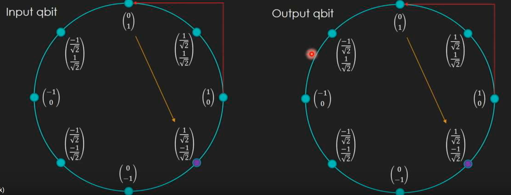

# Why ?

- Supremacy in 2017
- Shor's algorithm
- Grover's algorithm
- Why not ? It's really weird !


# Plan

- Linear algebra
- Qbits, superposition & quantum logical gates
- Deutsch oracle: simple problem for supremacy
- Teleportation example

# Linear algebra

## Bit representation


## Matrix multiplication


## Operations on one classic bit

- identity
- negation
- constant 0
- constant 1


## Reversible operations

- from output and operation, we have the input
- identiy - negation (reversible) permutation of bits
- constant 0 - constant 1 (not reversible) assignment of bits
- quantum use only reversible operations (magic same operation)
- mathematic explanation (matrix reverse)

## Tensor products of vectors

- explanation


- multiple cbits (product state + factorisation)


> this tensor representation is the product state

> the factorisation leads to bits

> the product state of n bit is a vector of size 2^n (scale up + exponential)

## CNOT

```java
Pair<Bit> CNOT(Pair<Bit> bits) {
  if(!bits.control) // if the control bits is 0
	return bits // nothing changed
  else // else the target is flipped
    return new Pair<Bit>(bits.control, !bits.target)

  // the control bit stays always the same
}
```


## CNOT on multiple bits


> fundamental to build large blocks in revesible computing

# QBits

> smallest information unit in quantum world

> cbits vectors are just special cases of qbits vectors

> qbits are represented with a & b complex numbers where ||a||²+||b||²=1

> Oh my godness, Pythagore again


## Complex numbers

- x² = -1

> not equal to squareRoot(-1)

- Number groups, complex numbers & beauty in algebra world
- a\*i+b

## Superposition

- the value is nor 0 nor 1, it called superposition
- both values in the same time
- **measure** => **collapse** to 0 or 1 (generally at the end of a quantum computation)

* qbit (a b) collapses to 0 with probability ||a||² and 1 with probability ||b||²

> coin flip and cbits (probability + Schrödinger)

> Polarisation with glass (vertical & horizontal - photons, electrons, ...)

- multiple qbits with tensor product


> ||ac||²+||ad||²+||bc||²+||bd||²=1

> Schrödinger's cat ????


## Operations on QBits

- like cbits : with matrices
- flip, CNot, ...
  
- matrix operators model the effect of device manipulating qbits spin (electron or nucleon) without measuring it

* several operators have sense only in quantum world

### The Hadamard gate

> puts a bit (0 or 1) in exact superposition state

- the gate
  

* reverse gate
  

> qbit to superposition and superposition to qbit

> transition out the superposition without measure it

> determinism vs probability

### Unit circle state machine

- Bit flip (negation) and Hadamard gate


> like the trigonometry

> complex numbers give a sphere (Bloch Sphere)


> the qbits cross over the circle


> obviously reversible

# The Deutsch Oracle

- Black box with operation on one bit (4 operations)
- Try input & output, you don't know the function
- How many queries in classic computer to determine the function ?
- In quantum computer ?

* What if to know about constant vs variable
* How many queries in classical world
* In quantum world ?

## How it works

- superposition
- define functions in quantum computing (problem with constants ?)

### Convert non reversible to reversible function ?

- common hack: add an addition qbit
  

* The input qbit is unchnaged, the result is on output qbit

### Constant 0


### Constant 1


### Identity


### Negation


## Solution


> if the function is constant, the measured bits will be |11>

> if the function is variable, the measured bits will be |01>



### Constant - 0


### Constant - 1


### Identity


### Negation


> negation is removed, cnot is magnified

> a generalization with n bits exists

> exponential speed up

# Entanglement

> if the **product state** of two qbits cannot be factorised, then the qbits are entangled. If they're not facotrisatble, then they cannot be separated, that means they don't have individual values. Them values have only sense together.to


> 50% chance to collapse on |00> and 50% chance to collaspes on |11> That's mean that the two qbits have always the same value.

## How to


## What's happening ?

- The qbits seems to be coordinating
- no matter of the spaces between them
- 2013 experiment with atomic clock -> 10000 thousand more quick than light
- chinese in 2017 faster than light (between satelitte & Earth)
- break locality principle but no information can be communicated ! Coordination is okay but no communication faster than light. (no violation of causality)

* it's a bit like we generated the same random number at a time based on probabilities

# Teleportation

- Quantum teleportation is the process by which the state of a QBit is transferred from one location to another by way of two entangled qbits

* You can cut/paste qbit but you cannot copy/paste (no duplication theorem)
* That's not faster than light because information must be sent. (communication)


# Readings

* [Quantum Computing for Computer Scientists](https://www.amazon.fr/Quantum-Computing-Computer-Scientists-Yanofsky/dp/0521879965)
* [Bell state](https://en.wikipedia.org/wiki/Bell_state)
* [Shor's algorithm](https://en.wikipedia.org/wiki/Shor%27s_algorithm)
* [Grover's algorithm](https://en.wikipedia.org/wiki/Grover%27s_algorithm)

# Let's go coding

* [Install Q# toolkit](https://marketplace.visualstudio.com/items?itemName=quantum.DevKit#review-details)
* [Write a quantum program](https://docs.microsoft.com/fr-fr/quantum/quickstart?view=qsharp-preview&tabs=tabid-vs2019)
* [Quantum Teleportation](https://blogs.msdn.microsoft.com/uk_faculty_connection/2018/02/27/quantum-teleportation-in-q/)


